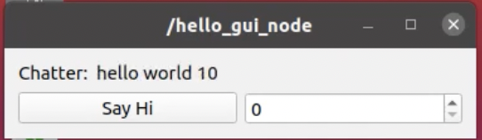

# README

**replace the README text above with your package name**

(Insert a paragraph here describing what your package does and maybe an image of it working)



## Installation ##

(Describe how to install your package here)


## Source Installation

(Describe how to install your package here)

### Begin by getting the package the dependencies ###

(Don't forget dependencies if necessary)

### Compile the package ###

(commands on how to install the package)

```
make sure you use code blocks to indicate command line to your users
```


## Running the package ##

(Describe how to run and the very basic 'hello world' use of your package here)

```
roslaunch norbit norbit.launch ip:<your unit's ip address>
```

## Parameters (for ROS packages) ##

(describe rosparams for your ROS package)

## Services (for ROS packages) ##

(describe how to use services here)

## Additional Documentation ##

(if you have additional documentation link it here)

## Contributing ##

Thank you for considering a contribution to this package.   Please review our [CONTRIBUTING](CONTRIBUTING.md) guidelines to get started.
